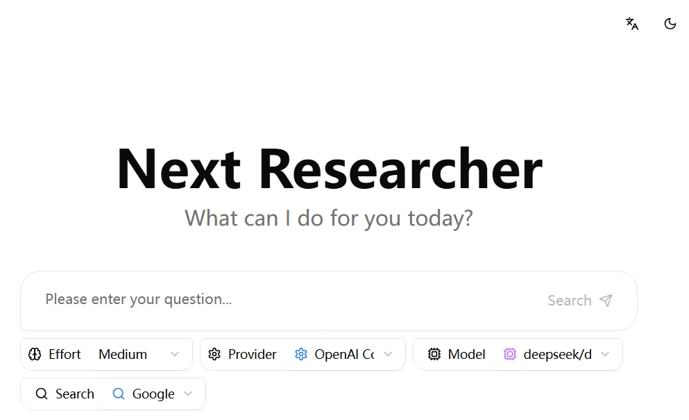

# NextResearcher: A Multi-Provider LLM Research Agent

This project builds upon the Google LangGraph Quickstart Kit with significant feature extensions and user experience improvements, delivering a more advanced research agent with multi-provider support and enhanced capabilities. Key enhancements include:

- The original project only supported Google's search engine. This version adds support for the Tavily search API and can be extended to other search service providers.

- The original project relied solely on Google's LLM API. This version adds compatibility with the OpenAI API, allowing the use of any model that supports the OpenAI API protocol.

- A theme switcher has been added to the web interface, enabling toggling between light and dark modes.

- The UI now supports language switching between English and Chinese.

The agent is designed to perform comprehensive research on a user's query by dynamically generating search terms, querying the web using Google Search, reflecting on the results to identify knowledge gaps, and iteratively refining its search until it can provide a well-supported answer with citations. 



## Features

- 💬 Fullstack application with a React frontend and LangGraph backend
- 🧠 Powered by a LangGraph agent for advanced research and conversational AI
- 🔄 **Multi-LLM Provider Support**: Switch between Google Gemini, Azure OpenAI, AWS Bedrock, and OpenAI-compatible providers
- 🎯 **Dynamic Provider Selection**: Choose LLM provider and model through the UI or environment configuration
- 🔍 **Multi-Search Provider Support**: Switch between Google Search and Tavily for web research.
- ⚙️ **Configurable Research Effort**: Adjust the depth and breadth of the research process ("low", "medium", "high") directly from the UI.
- 📄 Generates answers with citations from gathered sources
- 🔄 Hot-reloading for both frontend and backend during development
- 🏢 **Enterprise Ready**: Support for Azure OpenAI and AWS Bedrock cloud services

## LLM Provider Architecture

The application uses a modular LLM provider architecture that abstracts away provider-specific implementation details:

### Supported Providers

1. **Google Gemini** (`GOOGLE_GEMINI`)
   - Uses Google's Gemini API directly
   - Supports models: `gemini-1.5-pro`, `gemini-1.5-flash`, `gemini-1.0-pro`

2. **Azure OpenAI** (`AZURE_OPENAI`)
   - Uses Azure's OpenAI service
   - Supports GPT-4, GPT-3.5-turbo, and other Azure-deployed models

3. **AWS Bedrock** (`AWS_BEDROCK`)
   - Uses Amazon Bedrock service
   - Supports Claude, Llama, and other Bedrock-available models

4. **OpenAI Compatible** (`OPENAI_COMPATIBLE`)
   - Generic provider for OpenAI-compatible APIs
   - Works with OpenAI, local models (Ollama, LM Studio), and other compatible services

### Key Components

- **LLM Provider Factory**: Creates and manages provider instances
- **Unified Service Layer**: Provides consistent interface across all providers
- **Configuration Management**: Environment-driven provider and model selection
- **Structured Output Support**: Unified interface for structured data generation
- **Error Handling**: Comprehensive error handling and fallback mechanisms

## Project Structure

The project is divided into two main directories:

-   `frontend/`: Contains the React application built with Vite
-   `backend/`: Contains the LangGraph/FastAPI application, including the research agent logic

### Backend LLM Architecture

```
backend/src/agent/
├── llm_types.py              # Core data structures and types
├── llm_providers.py          # Base provider interface and registry
├── llm_factory.py            # Provider factory and configuration
├── llm_service.py            # Unified service layer
├── configuration.py          # Configuration management
└── providers/
    ├── gemini_llm_provider.py        # Google Gemini implementation
    ├── azure_openai_provider.py      # Azure OpenAI implementation
    ├── bedrock_llm_provider.py       # AWS Bedrock implementation
    └── openai_compatible_provider.py # Generic OpenAI-compatible provider
```

## Getting Started: Development and Local Testing

Follow these steps to get the application running locally for development and testing.

**1. Prerequisites:**

-   Node.js and npm (or yarn/pnpm)
-   Python 3.11+
-   **LLM Provider API Keys**: Choose one or more providers and obtain the required credentials

**2. Environment Configuration:**

Navigate to the `backend/` directory and create a `.env` file:

```bash
cd backend
cp .env.example .env
```

Configure your chosen LLM provider(s) in the `.env` file. Below are configuration examples for each provider:

### Google Gemini Configuration
```env
# Google Gemini (default provider)
LLM_PROVIDER=GOOGLE_GEMINI
GEMINI_API_KEY=your_gemini_api_key_here
GEMINI_MODELS=gemini-1.5-pro,gemini-1.5-flash,gemini-1.0-pro
GEMINI_DEFAULT_MODEL=gemini-1.5-pro
```

### Azure OpenAI Configuration
```env
# Azure OpenAI
LLM_PROVIDER=AZURE_OPENAI
AZURE_OPENAI_API_KEY=your_azure_openai_api_key
AZURE_OPENAI_ENDPOINT=https://your-resource.openai.azure.com/
AZURE_OPENAI_API_VERSION=2024-02-15-preview
AZURE_OPENAI_MODELS=gpt-4,gpt-4-turbo,gpt-35-turbo
AZURE_OPENAI_DEFAULT_MODEL=gpt-4
```

### AWS Bedrock Configuration
```env
# AWS Bedrock
LLM_PROVIDER=AWS_BEDROCK
AWS_ACCESS_KEY_ID=your_aws_access_key
AWS_SECRET_ACCESS_KEY=your_aws_secret_key
AWS_REGION=us-east-1
BEDROCK_MODELS=anthropic.claude-3-sonnet-20240229-v1:0,anthropic.claude-3-haiku-20240307-v1:0
BEDROCK_DEFAULT_MODEL=anthropic.claude-3-sonnet-20240229-v1:0
```

### OpenAI Compatible Configuration
```env
# OpenAI Compatible (OpenAI, Ollama, LM Studio, etc.)
LLM_PROVIDER=OPENAI_COMPATIBLE
OPENAI_COMPATIBLE_API_KEY=your_openai_api_key  # Optional for local models
OPENAI_COMPATIBLE_BASE_URL=https://api.openai.com/v1  # Change for local models
OPENAI_COMPATIBLE_MODELS=gpt-4,gpt-4-turbo,gpt-3.5-turbo
OPENAI_COMPATIBLE_DEFAULT_MODEL=gpt-4
```

**Configuration Notes:**
- Only configure the LLM provider(s) you plan to use
- Unconfigured providers will be automatically ignored and won't appear in the frontend
- For local models (like Ollama), `OPENAI_COMPATIBLE_API_KEY` can be left empty
- The frontend will only show providers that are properly configured with valid environment variables

**3. Install Dependencies:**

**Backend:**

```bash
cd backend
pip install .
```

**Frontend:**

```bash
cd frontend
npm install
```

**4. Run Development Servers:**

**Backend & Frontend:**

```bash
make dev
```
This will run the backend and frontend development servers. Open your browser and navigate to the frontend development server URL (e.g., `http://localhost:5173/app`).

_Alternatively, you can run the backend and frontend development servers separately. For the backend, open a terminal in the `backend/` directory and run `langgraph dev --allow-blocking`. The backend API will be available at `http://127.0.0.1:2024`. It will also open a browser window to the LangGraph UI. For the frontend, open a terminal in the `frontend/` directory and run `npm run dev`. The frontend will be available at `http://localhost:5173`._

## How the Backend Agent Works (High-Level)

The core of the backend is a LangGraph agent defined in `backend/src/agent/graph.py`. It follows these steps, with its behavior dynamically adjusted by your selections in the frontend:


1.  **Generate Initial Queries:** Based on your input and the selected **"Effort"** level, it generates an initial set of search queries using your configured LLM provider and model.
2.  **Web Research:** For each query, it uses your chosen **Search Provider** (e.g., Google Search, Tavily) to find relevant web pages.
3.  **Reflection & Knowledge Gap Analysis:** The agent analyzes the search results to determine if the information is sufficient or if there are knowledge gaps. It uses the LLM for this reflection process.
4.  **Iterative Refinement:** If gaps are found, it generates follow-up queries and repeats the web research and reflection steps. The maximum number of iterations is controlled by the **"Effort"** setting.
5.  **Finalize Answer:** Once the research is deemed sufficient, the agent synthesizes the gathered information into a coherent answer, including citations from the web sources, using the LLM.

The agent automatically uses your configured LLM provider and can switch between different providers and models through the frontend interface or environment configuration.

## CLI Example

For quick one-off questions you can execute the agent from the command line. The
script `backend/examples/cli_research.py` runs the LangGraph agent and prints the
final answer:

```bash
cd backend
python examples/cli_research.py "What are the latest trends in renewable energy?"
```

## API Endpoints

The backend provides several API endpoints for LLM provider management:

- `GET /api/llm-providers` - List all available LLM providers
- `GET /api/llm-providers/{provider_name}/models` - Get available models for a specific provider
- `POST /runs/stream` - Execute research queries with specified LLM provider and model

## Frontend Interface

The frontend interface provides comprehensive control over the research agent's behavior:

-   **Provider Selection Dropdown**: Choose from available LLM providers (e.g., Gemini, Azure OpenAI).
-   **Model Selection Dropdown**: Dynamically populated with models available from the selected provider (e.g., `gemini-1.5-pro`, `gpt-4`).
-   **Search Provider Selection Dropdown**: Switch between integrated search engines like Google Search and Tavily.
-   **Effort Selection Dropdown**: Control the "effort" of the research agent:
    -   **Low**: Performs a quick, surface-level search with 1 initial query and 1 research loop.
    -   **Medium**: A balanced approach with 3 initial queries and up to 3 research loops.
    -   **High**: A deep, comprehensive search with 5 initial queries and up to 10 research loops for maximum detail.

## Deployment

In production, the backend server serves the optimized static frontend build. LangGraph requires a Redis instance and a Postgres database. Redis is used as a pub-sub broker to enable streaming real time output from background runs. Postgres is used to store assistants, threads, runs, persist thread state and long term memory, and to manage the state of the background task queue with 'exactly once' semantics. For more details on how to deploy the backend server, take a look at the [LangGraph Documentation](https://langchain-ai.github.io/langgraph/concepts/deployment_options/).

### Docker Deployment

Below is an example of how to build a Docker image that includes the optimized frontend build and the backend server and run it via `docker-compose`.

_Note: For the docker-compose.yml example you need a LangSmith API key, you can get one from [LangSmith](https://smith.langchain.com/settings)._

_Note: If you are not running the docker-compose.yml example or exposing the backend server to the public internet, you should update the `apiUrl` in the `frontend/src/App.tsx` file to your host. Currently the `apiUrl` is set to `http://localhost:8123` for docker-compose or `http://localhost:2024` for development._

**1. Build the Docker Image:**

   Run the following command from the **project root directory**:
   ```bash
   docker build -t multi-provider-llm-research -f Dockerfile .
   ```

**2. Configure Environment Variables:**

   Update your environment variables in the docker-compose.yml or create a `.env` file with your chosen LLM provider configuration.

**3. Run the Production Server:**

   ```bash
   # For Google Gemini
   GEMINI_API_KEY=<your_gemini_api_key> LANGSMITH_API_KEY=<your_langsmith_api_key> docker-compose up
   
   # For Azure OpenAI
   LLM_PROVIDER=AZURE_OPENAI AZURE_OPENAI_API_KEY=<your_key> AZURE_OPENAI_ENDPOINT=<your_endpoint> LANGSMITH_API_KEY=<your_langsmith_api_key> docker-compose up
   
   # For AWS Bedrock
   LLM_PROVIDER=AWS_BEDROCK AWS_ACCESS_KEY_ID=<your_key> AWS_SECRET_ACCESS_KEY=<your_secret> LANGSMITH_API_KEY=<your_langsmith_api_key> docker-compose up
   
   # For OpenAI Compatible
   LLM_PROVIDER=OPENAI_COMPATIBLE OPENAI_COMPATIBLE_API_KEY=<your_key> OPENAI_COMPATIBLE_BASE_URL=<your_base_url> LANGSMITH_API_KEY=<your_langsmith_api_key> docker-compose up
   ```

Open your browser and navigate to `http://localhost:8123/app/` to see the application. The API will be available at `http://localhost:8123`.

## Configuration Options

### Environment Variables

The application supports extensive configuration through environment variables:

#### Core Configuration
- `LLM_PROVIDER`: Choose from `GOOGLE_GEMINI`, `AZURE_OPENAI`, `AWS_BEDROCK`, `OPENAI_COMPATIBLE`
- `MAX_SEARCH_LOOPS`: Maximum number of research iterations (default: 3)
- `SEARCH_PROVIDER`: Search provider to use (default: `GOOGLE_SEARCH`)

#### Provider-Specific Configuration
Each provider has its own set of configuration variables. See the `.env.example` file for complete configuration options.

### Runtime Configuration

You can also override the LLM provider and model at runtime through:
- Frontend UI selection
- API request parameters
- LangGraph configuration

## Troubleshooting

### Common Issues

1. **Provider Not Showing in Frontend**
   - Check that all required environment variables are set for your provider
   - Verify your `.env` file is in the `backend/` directory
   - Ensure `LLM_PROVIDER` matches one of: `GOOGLE_GEMINI`, `AZURE_OPENAI`, `AWS_BEDROCK`, `OPENAI_COMPATIBLE`
   - Only properly configured providers will appear in the frontend dropdown

2. **Provider Authentication Errors**
   - Verify your API keys are correct and have proper permissions
   - Check that your Azure/AWS credentials are properly configured
   - Ensure your OpenAI-compatible endpoint is accessible
   - For `OPENAI_COMPATIBLE_BASE_URL`, make sure the URL is reachable

3. **Model Not Available**
   - Check that the model is available in your provider's region
   - Verify the model name matches the provider's expected format
   - Ensure you have access to the specific model
   - Models are now read from configuration only, not fetched from APIs

4. **Rate Limiting**
   - The application includes built-in rate limiting and retry logic
   - Consider upgrading your provider plan if you hit limits frequently

5. **Network Issues**
   - Verify your network can access the provider's API endpoints
   - Check firewall settings for outbound connections
   - For local models, ensure the service is running and accessible
   - Startup no longer requires network calls to fetch model lists

### Debug Mode

Enable debug logging by setting:
```env
LOG_LEVEL=DEBUG
```

## Technologies Used

- [React](https://reactjs.org/) (with [Vite](https://vitejs.dev/)) - For the frontend user interface
- [Tailwind CSS](https://tailwindcss.com/) - For styling
- [Shadcn UI](https://ui.shadcn.com/) - For components
- [LangGraph](https://github.com/langchain-ai/langgraph) - For building the backend research agent
- [LangChain](https://github.com/langchain-ai/langchain) - For LLM integrations and abstractions

### LLM Providers
- [Google Gemini](https://ai.google.dev/models/gemini) - Google's advanced language models
- [Azure OpenAI](https://azure.microsoft.com/en-us/products/ai-services/openai-service) - Enterprise OpenAI models on Azure
- [AWS Bedrock](https://aws.amazon.com/bedrock/) - Amazon's managed foundation model service
- [OpenAI](https://openai.com/) - OpenAI's GPT models and compatible APIs

## Migration from Gemini-Only Version

If you're upgrading from a previous version that only supported Google Gemini:

1.  **Update Dependencies**: Run `pip install .` in the backend directory
2.  **Update Environment Variables**: Update your `.env` file with the new provider-specific variable names:
    - Gemini: Use `LLM_PROVIDER=GOOGLE_GEMINI` (was `gemini`)
    - For OpenAI Compatible: Use `OPENAI_COMPATIBLE_*` prefixed variables
3.  **Frontend Changes**: The UI now includes provider, model, search, and effort selection dropdowns
4.  **API Changes**: The `/runs/stream` endpoint now accepts `llmProvider`, `searchProvider`, and other parameters
5.  **Configuration Validation**: Only properly configured providers will appear in the frontend
6.  **Performance Improvement**: Model lists are now read from configuration, eliminating startup API calls

Your existing Gemini configuration will continue to work with minor environment variable updates, and you can now add additional providers as needed.

## License

This project is licensed under the Apache License 2.0. See the [LICENSE](LICENSE) file for details.
